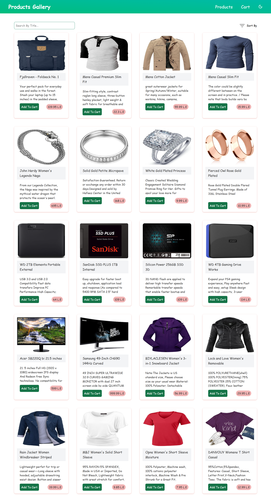
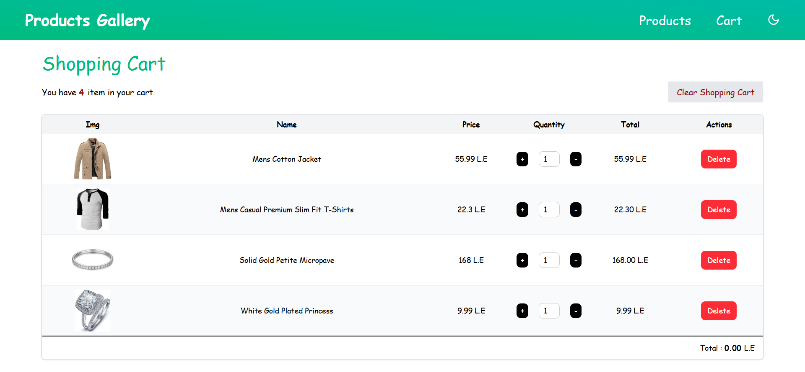

# 🛍️ Products Gallery Web Application

## 📝 Project Overview

A fully functional and responsive **Products Gallery Web App** built using React and Tailwind CSS. The application fetches product data from the [Fake Store API](https://fakestoreapi.com/products) and allows users to:

- Browse products by image and title
- Filter products using a search bar
- Sort products by price and name
- View full product details
- Manage a persistent shopping cart (using `localStorage`)
- Navigate dynamically to product pages
- Enjoy a seamless shopping experience across all device sizes

---

## 🖼️ Screenshots / Demo

### 💻 Products Page

### 📱 Product Details Page 

### 🛒 Cart Page

> 🔗 **Live Demo:** [your-live-demo-link.com](https://your-live-demo-link.com) *(optional)*

---

## 🧱 Tech Stack Used

| Layer       | Tech                        |
|-------------|-----------------------------|
| Framework   | React (v18)                 |
| Styling     | Tailwind CSS                |
| State Mgmt  | React Hooks (`useState`, `useEffect`) |
| Data Source | [FakeStoreAPI](https://fakestoreapi.com/) |
| Storage     | localStorage                |
| Routing     | React Router                |

---

## 📌 Key Features

- 🔄 **Dynamic Routing** for `/products/:id`
- 🔍 **Search Filtering** by title (case-insensitive)
- ↕️ **Sorting** by price and name
- 🛒 **Cart Functionality** with quantity management
- 📦 **Product Details Page** with:
  - Name
  - Description
  - Image
  - Price
  - Category
  - ⭐ Rating (optional enhancement)
- 🎨 **Dark Mode Toggle** *(optional enhancement)*
- 🖥️ **Fully Responsive** (mobile-first design)
- 🚫 **Error & Loading States** for robust UX

---